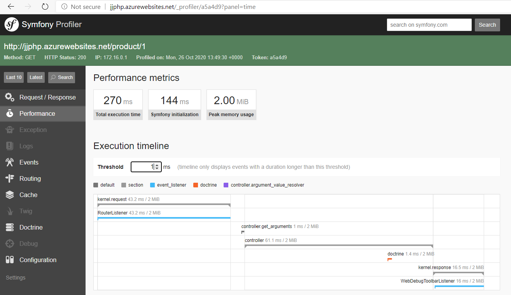
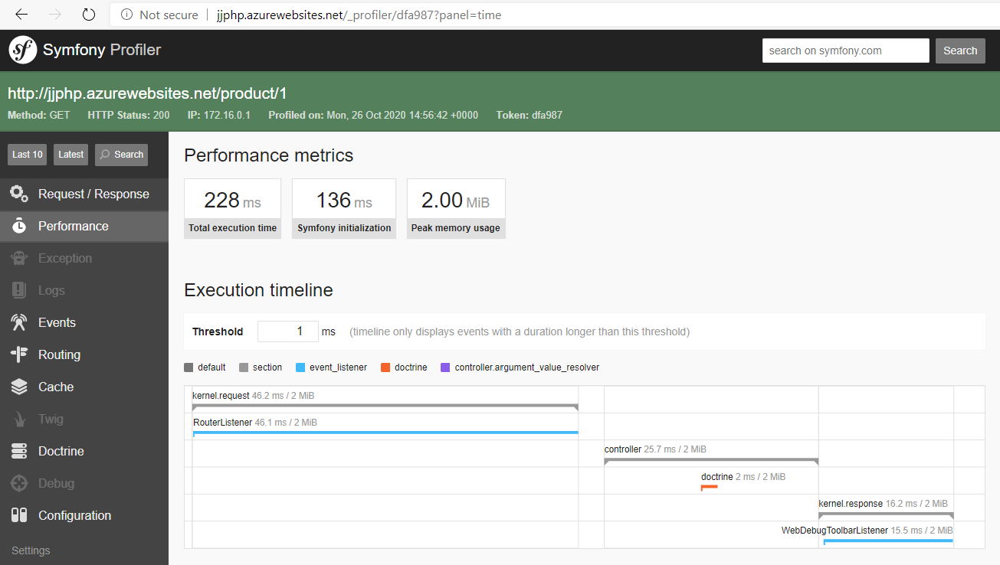

# JJWebPhp API service with PHP Symfony framework

## Create Azure Database for mySql

It creates

- Azure Database for MySql or for MariaDB (without SSL enforcement)
- Azure Web App for PHP

Run ARM deployment [deploy.ps1](/arm-deploy/deploy.ps1)

## Create webapp with PHP Symfony

Setup dev machine

- install Symfony CLI
- https://symfony.com/doc/current/setup.html#technical-requirements
- Visual Studio Code extension Symfony for VSCode

```bash
sudo apt-get install php
sudo apt install mysql-client-core-5.7
sudo apt-get install php-xml
sudo apt-get install php-mysql
```

Create new project

```bash
symfony new jjwebphpsymfon
composer require symfony/orm-pack
composer require --dev symfony/maker-bundle

symfony serve
~/.symfony/bin/symfony serve
php -S 0.0.0.0:8000 ./public/index.php
```

Add new controller - https://symfony.com/doc/current/controller.html#returning-json-response

Use mySql with Symfony

- Doctrine ORM https://symfony.com/doc/current/doctrine.html
- https://symfony.com/doc/current/doctrine.html#creating-an-entity-class
- Doctrine drivers https://www.doctrine-project.org/projects/doctrine-dbal/en/2.10/reference/configuration.html

Configured doctrine.yaml and run script to initialize database - jjdb on mySql server and table product

```bash
php bin/console doctrine:database:create
php bin/console make:entity

php bin/console make:migration
php bin/console doctrine:migrations:migrate

php bin/console doctrine:query:sql 'SELECT * FROM product'
```

Use Profiler

- check response HEADER to get url from Profiler page, e.g. http://127.0.0.1:8000/_profiler/712f0e

```bash
composer require --dev symfony/profiler-pack
```

Check application running http://127.0.0.1:8000/product

## Deploy webapp to Azure

### Update Azure Database for mySql

```bash
php bin/console doctrine:database:create
php bin/console doctrine:migrations:migrate
```

### Deploy to Azure Web App

Configure Azure Web App in Deployment Center to use Local Git. Next follow [Local Git integration](https://docs.microsoft.com/en-us/azure/app-service/deploy-local-git).

```bash
git remote add azure https://jjphp.scm.azurewebsites.net:443/jjphp.git
git push azure master
```

Login into Azure Web App SSH and copy .htaccess.azure

## Results

Call https://jjphp.azurewebsites.net/product/1

Find Header X-Debug-Token-Link: like http://jjphp.azurewebsites.net/_profiler/a5a4d9



To reduce mySql connection time we changed driver to mysqli, check results.
Getting same results wit Azure Database with MariaDb.


